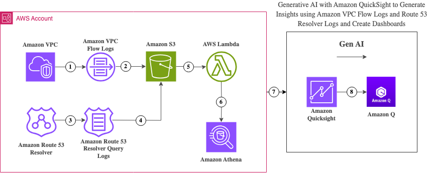

# Visualize and Gain Insights Into Your VPC with Amazon Quicksight and Q

## Introduction
AWS services generate vast amounts of data in the form of logs and metrics, making it challenging to create dashboards that provide meaningful insights regarding your VPCs. This GitHub repository provides various examples which demonstrate how [Amazon QuickSight](https://aws.amazon.com/quicksight/) can be leveraged for data visualization.

Amazon QuickSight is a fully managed, cloud-scale business intelligence (BI) service that allows users to create and share interactive dashboards, perform ad-hoc analysis, and gain insights from their data through visualizations. On April 30th, 2024, AWS announced the general availability of [Amazon Q in Quicksight](https://aws.amazon.com/about-aws/whats-new/2024/04/amazon-q-quicksight/), which enhances QuickSight by providing generative AI capabilities to visualize data using natural language queries.

The intent is to demonstrate how data from any source can be easily visualized with QuickSight, emphasizing its benefits for users with varying levels of technical knowledge. Click on the architecture diagrams below to be redirected to the documentation for the respective example. The example provides detailed documentation on the architecture and deployment instructions for the provided CloudFormation template.  

## Architecture Diagrams
**Enriched VPC Flowlogs with Amazon Quicksight in Q**

**VPC Flowlogs and Route53 Resolver Logs with Amazon Quicksight in Q**

