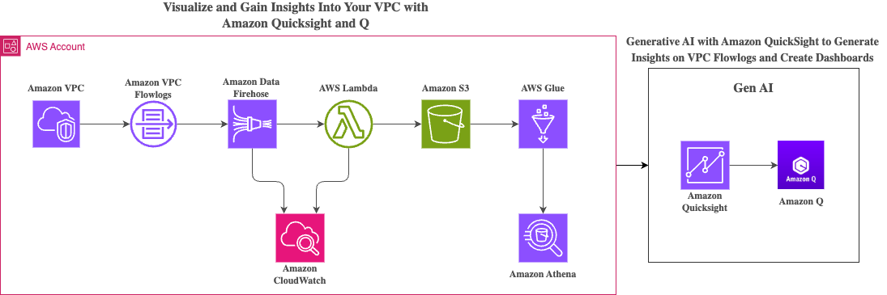
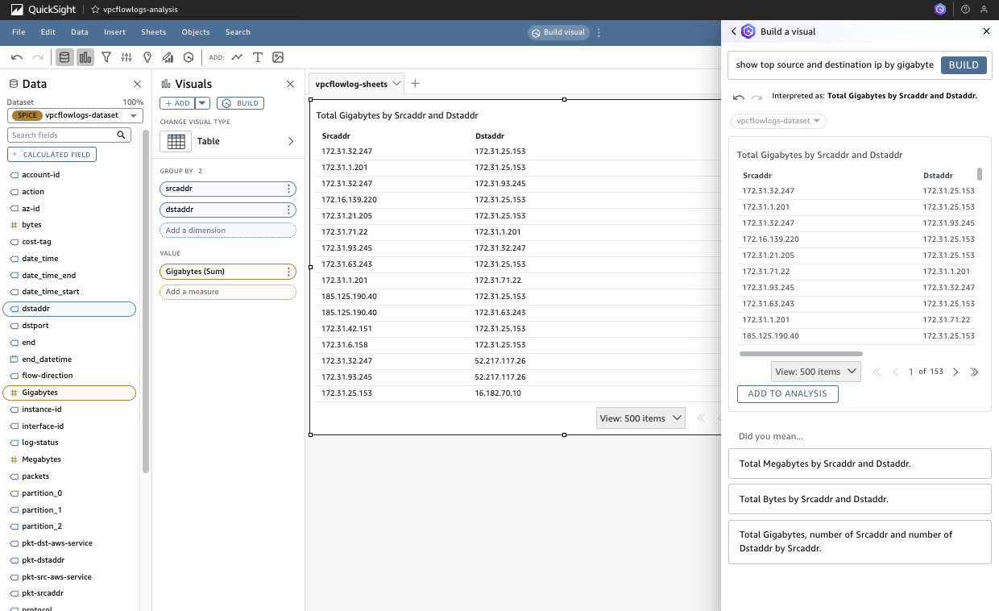
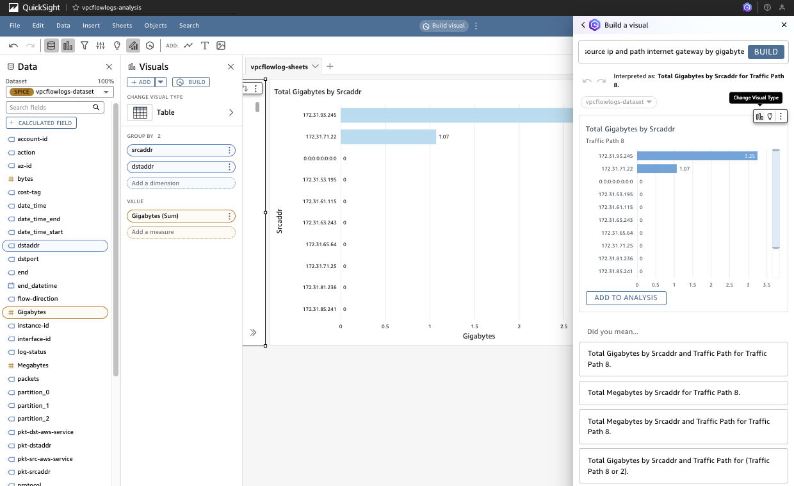
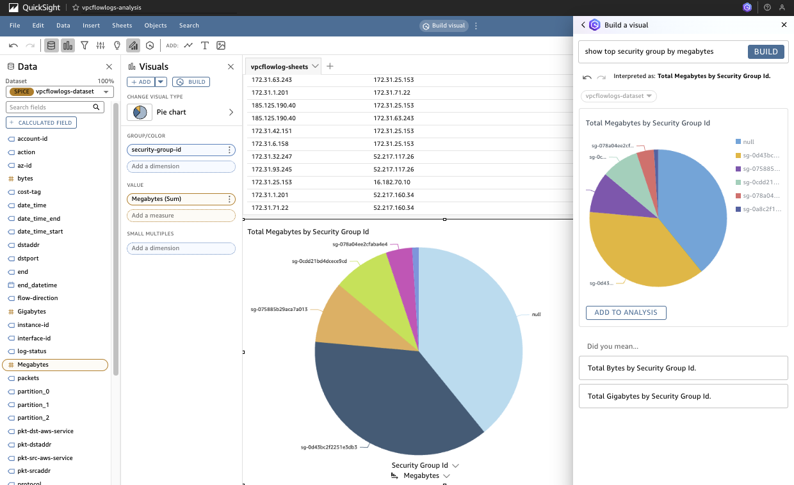
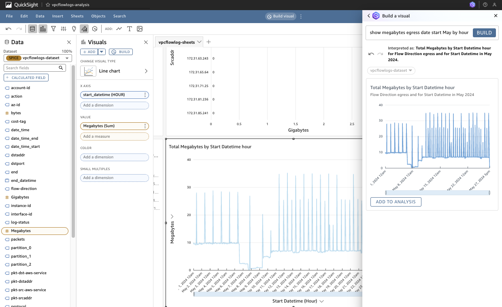

# Enriched VPC Flowlogs With Quicksight in Q

## Introduction
AWS services generate vast amounts of data in the form of logs and metrics, making it challenging to create dashboards that provide meaningful insights, such as connectivity patterns in VPCs. This sample architecture will demonstrate how [Amazon QuickSight](https://aws.amazon.com/quicksight/) can be leveraged for data visualization.

Amazon QuickSight is a fully managed, cloud-scale business intelligence (BI) service that allows users to create and share interactive dashboards, perform ad-hoc analysis, and gain insights from their data through visualizations. On April 30th, 2024, AWS announced the general availability of [Amazon Q in Quicksight](https://aws.amazon.com/about-aws/whats-new/2024/04/amazon-q-quicksight/), which enhances QuickSight by providing generative AI capabilities to visualize data using natural language queries.

This example demonstrates how to collect data from VPC flowlogs, enrich the logs via a Lambda to add additional attributes not natively available in VPC flowslogs. This example demonstrates how the Lambda adds the security group of the corresponding EC2 instance and the value of the **cost-tag** tag for the instance to the VPC flowlogs. The functions in the Lambda can be expanded to other use cases as required.

With the VPC flowlogs enriched, this example shows how Amazon Q can be leveraged to quickly generate visualizations from common natural language queries, highlighting the ease and efficiency of using QuickSight and Q for generating insightful dashboards.

The intent is to demonstrate how data from any source can be easily visualized with QuickSight, emphasizing its benefits for users with varying levels of technical knowledge.

## Architecture Diagram
Below is the architecture diagram that illustrates the components and flow of data within this example solution:



1. **VPC Flow Logs**: Flow logs are enabled for your VPC and sent to CloudWatch Logs.
2. **Amazon Firehose**: Streams the VPC flow logs to S3 via a Lambda.
3. **AWS Lambda**: A Lambda function enrich, transform the logs and stores the processed data in an S3 bucket.
4. **Amazon S3**: Stores the enriched VPC flowlogs data.
5. **AWS Glue**: Crawls the S3 bucket to catalog the data for querying.
6. **Amazon Athena**: Queries the cataloged data from AWS Glue.
7. **Amazon QuickSight**: Visualizes the data stored in S3, providing a comprehensive dashboard for analysis.
8. **Amazon Q**: Interprets natural language queries to faciliate the development of visuals in the analysis.


## Prerequisites
Before deploying the VPC Flowlogs CloudFormation template, ensure you have the following prerequisites in place:

1. **AWS Account**: You will need an active AWS account with the necessary permissions to deploy and manage AWS resources.
2. **AWS CLI**: Install and configure the AWS Command Line Interface (CLI) on your local machine.
3. **CloudFormation Template**: Download the CloudFormation template (`qs-vpcflow-logs-cfn.yaml`) from the repository.
4. **Review Quicksight Q Pricing**: Become familiar with the Quicksight Q [pricing](https://aws.amazon.com/quicksight/pricing/).
5. **Amazon QuickSight Initial Set Up**: Complete the Amazon QuickSight [initial set up](https://docs.aws.amazon.com/quicksight/latest/user/setting-up.html) if it has not already been done previously.
6. **Amazon QuickSight Account**: Ensure you have an Amazon QuickSight account set up and have sufficient permissions to create dashboards. Users need to have a **PRO** role assigned to be able to leverage Q in quicksight. For more information see [Managing user access inside Amazon QuickSight](https://docs.aws.amazon.com/quicksight/latest/user/managing-users.html) and [How to update my user in Amazon QuickSight to ADMIN PRO?](https://repost.aws/articles/ARLexnrP0DSLKU7ZBPB6jTgQ/how-to-update-my-user-in-amazon-quicksight-to-admin-pro). To retrieve the Amazon QuickSight Principal ARN, please see [link](https://docs.aws.amazon.com/quicksight/latest/developerguide/list-users.html).
7. **IAM Roles**: Ensure you have the necessary IAM roles with permissions to create and manage resources like Lambda functions, S3 buckets, Kinesis streams, Glue, and Athena queries.

## Deployment Instructions
Follow these steps to deploy the VPC Flowlogs CloudFormation template using AWS CloudFormation:

### Step 1: Download the CloudFormation Template
Download the `qs-vpcflow-logs-cfn.yaml` file from the repository to your local machine.
### Step 2: Deploy the CloudFormation Stack
1. Open the AWS Management Console and navigate to the CloudFormation service.
2. Click on **Create stack** and choose **With new resources (standard)**.
3. Select **Upload a template file**, then click **Choose file** and select the `vpc-flow-log-dashboard.yaml` file you downloaded.
4. Click **Next**.
### Step 3: Configure Stack Details
1. **Stack name**: Enter a name for your stack (e.g., `VPCFlowLogsQuickSight`).
2. **Parameters**: Provide the required parameters such as S3 Bucket name, QuickSight User ARN, etc.
    - `BucketNameVpcLogsPrefix` - The prefix to be used for the unique S3 bucket that will be created to store the VPC flow logs. The bucket name prefix will be appended with a random ID based from the stack ID.
    - `CreateQsTopic` - Optional **true**/**false** parameter that provides the flexibility to selectively deploy (**true**) or not deploy (**false**) the Q topic.
    - `QuicksightServiceRole` - The role that Quicksight will assume to access resources consumed by the QuickSight dataset. The CloudFormation template will grant access to Athena and the VPC Flowlogs S3 bucket. The default service role is **aws-quicksight-service-role-v0**
    - `QuicksightUserARN` - The user who will be granted access to the QuickSight constructs being deployed e.g., dataset, topic, analysis
    - `VpcId` - The VPC ID of an existing VPC that will have VPC Flowlogs enabled by CloudFormation. VPC Flowlogs will be configured to deliver the logs to Firehose.
3. Click **Next**.
### Step 4: Configure Stack Options
1. Configure any additional options as needed (e.g., tags, permissions, etc.).
2. Click **Next**.
### Step 5: Review and Create Stack
1. Review the stack details and ensure everything is correct.
2. Acknowledge that CloudFormation will create IAM resources.
3. Click **Create stack**.
### Step 6: Monitor the Deployment
1. Monitor the stack creation progress in the CloudFormation console.
2. Once the stack status changes to `CREATE_COMPLETE`, the deployment is successful.
### Step 7: Refresh the Dataset
1. Navigate to Amazon QuickSight.
2. On the left hand pane, Click on **Dataset**.
3. Click on the `vpcflowlogs-dataset` Dataset.
4. In the **Summary** screen you will be able to see the status of the latest refresh. If the status is `Status Completed` and has greater than 0 rows imported then skip to **Step 8**. The Dataset has been configured to run every hour. If you try to access the QuickSight analysis within an hour of the CloudFormation template being deployed, it is likely the Dataset has not yet imported the data from Athena. 
4. Click on the tabs at the top, navigate to **Refresh**. On the top right corner, click on **REFRESH NOW**. Wait a few minutes while the job completes.
### Step 8: Review the Q Topic
1. On the top left corner, click on the **QuickSight** logo to return to the QuickSight main screen.
2. On the left hand pane, Click on **Topics**.
3. Click on the `vpc-flowlogs-topic` Topic.
4. Click on the tabs at the top, navigate to Data, then **DATA FIELDS**. The data fields are automatically populated with the fields in the dataset. Quicksight will populate where possible synonyms for the corresponding fields. In this example the synonyms have been defined in the CloudFormation Template. Synonyms assist Amazon Q in correlating your queries with the fields in the data set. Further customization relevant to the terminology used by your organization can be added. This results in more meaningful and accurate responses from Amazon Q.
### Step 9: Link the Q Topic to the Analysis
1. On the top left corner, click on the **QuickSight** logo to return to the QuickSight main screen.
2. On the left hand pane, Click on **Analysis**.
3. Click on the `vpcflowlogs-analysis` Analysis.
4. On the centre of the top bar, click the vertical ellipsis `⋮` next to **Build visual**, select **Topic Linking** from the menu. Enable **Link topic for Build Visual and Q&A**, select `vpcflowlogs-topic` from the drop down. Click **APPLY CHANGES**.

> [!NOTE]
>
> The user working on the analysis must have a **PRO** role. If the user does not have a **PRO** role, QuickSight will hide the **Build visual** button. For more information see [Managing user access inside Amazon QuickSight](https://docs.aws.amazon.com/quicksight/latest/user/managing-users.html) and [How to update my user in Amazon QuickSight to ADMIN PRO?](https://repost.aws/articles/ARLexnrP0DSLKU7ZBPB6jTgQ/how-to-update-my-user-in-amazon-quicksight-to-admin-pro).

### Step 8: Begin Populating the Analysis with Visuals
1. On the centre of the top bar, click **Build visual**. The Build a visual right pane will be revealed. Begin by typing the first natural language question. In the next section we provide 4 sample questions to get you started. The QuickSight documentation provider [types of questions supported by Q](https://docs.aws.amazon.com/quicksight/latest/user/quicksight-q-ask.html#quicksight-q-ask-types) with more sample questions.
2. Amazon Q will interpret the questions and derive a query based on the field from the dataset and the defined synonyms in the linked topic. Amazon Q will also select a visual type, this can be changed. On the top right of the visual, click on the image of a bar graph and select the visual type that best visually represents the data for you. Click **ADD TO ANALYSIS**

## Sample Natural Language Queries
```
show top source and destination ip by gigabyte
```



``` 
show top source ip and path internet gateway by gigabyte
```



``` 
show top security group by megabytes
```



``` 
show megabytes egress date start May by hour
```



## Conclusion
Via this example, you have learned how to leverage the Amazon Quicksight to visualize data from various data sources using natural language queries. Amazon QuickSight Q democratize data access, making it easier for everyone in your organization to make data-driven decisions. By organizing your data into intuitive topics and enabling natural language queries, QuickSight Q empowers users to get the insights they need, when they need them.

## Clean Up
### Step 1: Disable VPC Flow logs
1. Navigate to **VPC** in the AWS console
2. On the left hand pane, click on **Your VPCs**
3. Select the VPC you enabled VPC flow logs via the CloudFormation template by clicking on the empty box at the start of the row
4. Click on **Flow logs** on the tabs at the bottom of the screen
5. Select the VPC flow log
6. On the top right, click **Actions**
7. In the drop down, select **Delete flow logs** to delete the selected VPC Flow log
### Step 2: Empty the VPC Flow logs S3 Bucket
1. Navigate to **S3** in the AWS console
2. Select the VPC Flow log S3 bucket via the radio button
3. On the top right of the table, click **Empty**
4. Type "permanently delete" and then press **Empty**
### Step 3: Delete the CloudFormation Stack
1. Navigate to **CloudFormation** in the AWS console
2. Select the VPC Flow log CloudFormation stack name via the radio button
3. On the top right, click **Delete**
4. Wait for the CloudFormation template to complete deletion