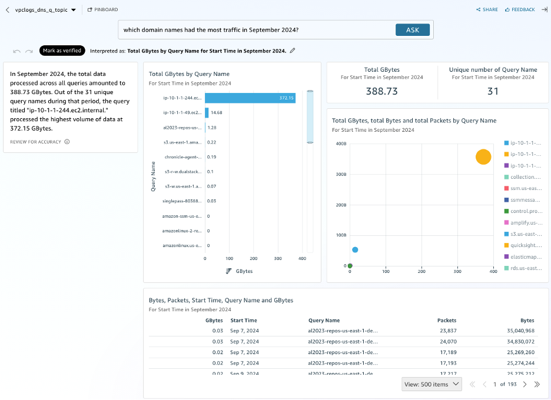
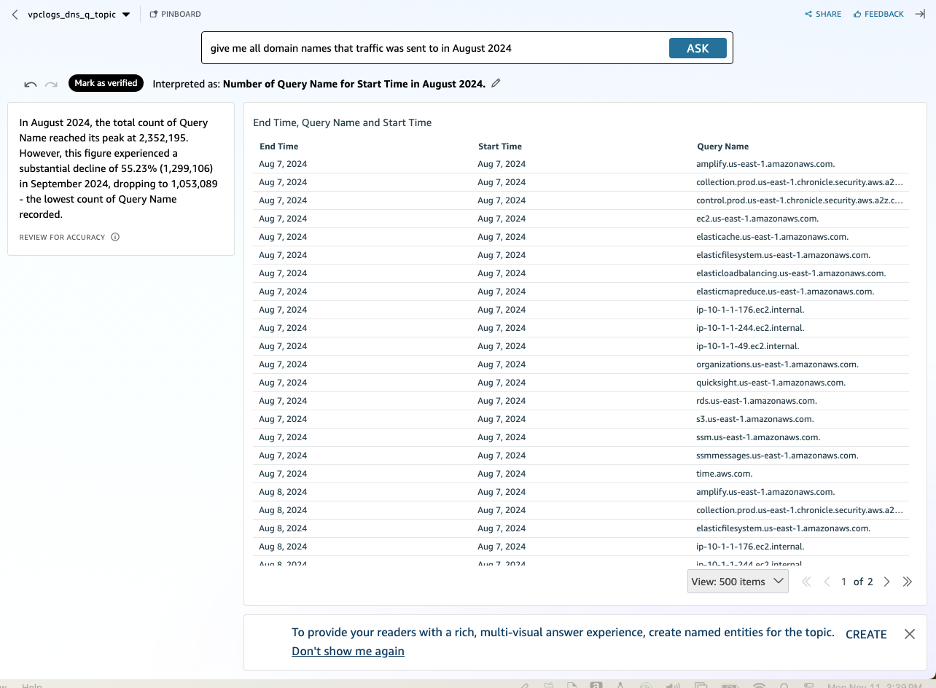
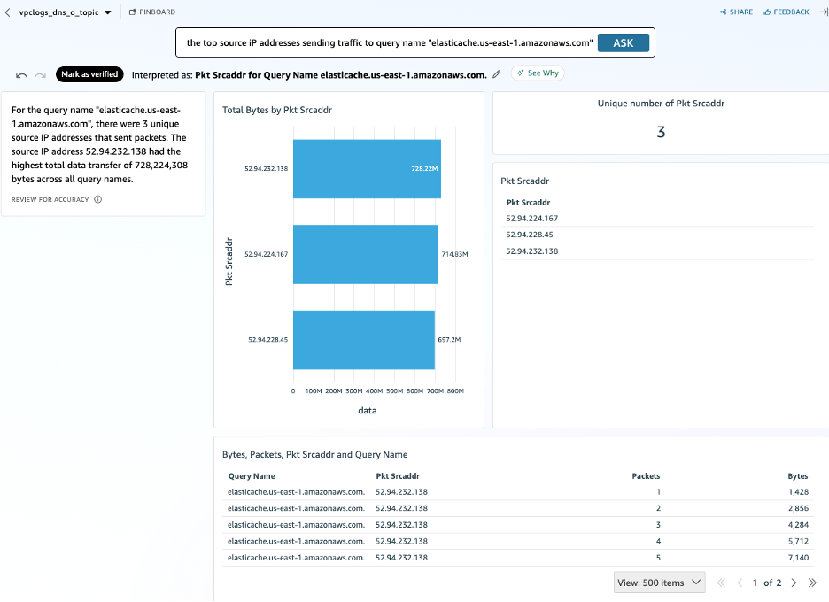
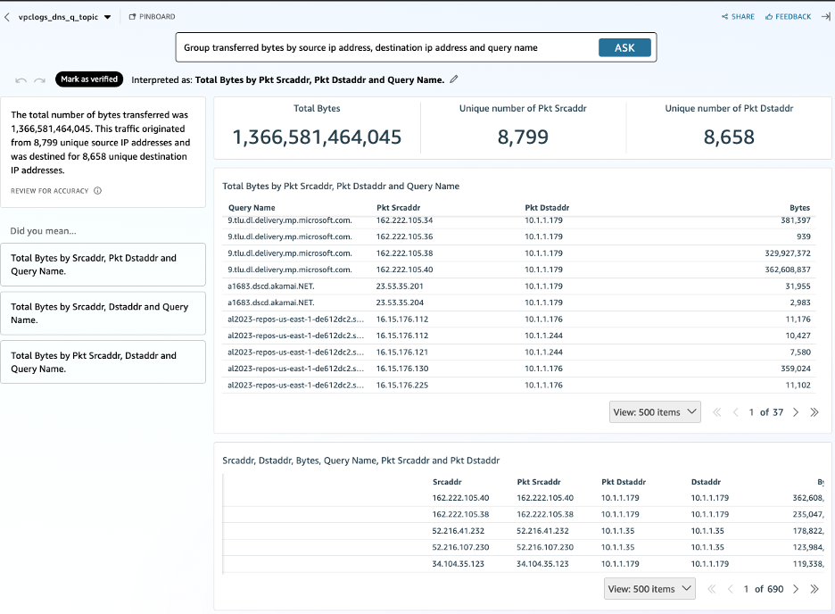

# Combined VPC + Route 53 Resolver logs and gaining insights With Quicksight in Q

## Introduction
This sample architecture will demonstrate how [Amazon QuickSight](https://aws.amazon.com/quicksight/) can be leveraged for visualing combined VPC and Route 53 Resolver logs.

Amazon QuickSight is a fully managed, cloud-scale business intelligence (BI) service that allows users to create and share interactive dashboards, perform ad-hoc analysis, and gain insights from their data through visualizations. On April 30th, 2024, AWS announced the general availability of [Amazon Q in Quicksight](https://aws.amazon.com/about-aws/whats-new/2024/04/amazon-q-quicksight/), which enhances QuickSight by providing generative AI capabilities to visualize data using natural language queries.

It demonstrates how to collect data from VPC flowlogs and combine it with Route 53 Resolver Query Logs. With the enriched dataset, this example shows how Amazon Q can be leveraged to quickly generate visualizations from common natural language queries, highlighting the ease and efficiency of using QuickSight and Q for generating insightful dashboards.

The intent is to;
1) Show how you can generate new insights with the combination of both logs
2) Demonstrate how data from any source can be easily visualized with QuickSight, emphasizing its benefits for users with varying levels of technical knowledge.

## Architecture Diagram
Below is the architecture diagram that illustrates the components and flow of data within this example solution:


- **VPC Flow Logs**: Flow logs are enabled for your VPC and sent to Amazon S3.
- **Route 53 Resolver Query Logs**: Route 53 Resolver query logs are enabled for your VPC and sent to Amazon S3.
- **Amazon S3**: Stores the VPC flowlogs data and Route 53 Resolver query logs data in respective buckets.
- **Amazon Lambda**: Lambda function executes the named queries for creation of Tables and View in Athena.
- **AWS Athena**: Query and analyze your VPC flow logs & Route 53 Resolver query logs data directly from S3.
- **Amazon QuickSight**: Visualizes the data stored in S3, providing a comprehensive dashboard for analysis.
- **Amazon Q**: Interprets natural language queries to faciliate the development of visuals in the analysis.


## Prerequisites
Before deploying the VPC Flowlogs CloudFormation template, ensure you have the following prerequisites in place:

1. **AWS Account**: You will need an active AWS account with the necessary permissions to deploy and manage AWS resources.
2. **AWS CLI**: Install and configure the AWS Command Line Interface (CLI) on your local machine.
3. **CloudFormation Template**: Download the CloudFormation template (`vpcflowlog-plus-route53resolverlog-dashboard.yml
`) from the repository.
4. **Review Quicksight Q Pricing**: Become familiar with the Quicksight Q [pricing](https://aws.amazon.com/quicksight/pricing/).
5. **Amazon QuickSight Initial Set Up**: Complete the Amazon QuickSight [initial set up](https://docs.aws.amazon.com/quicksight/latest/user/setting-up.html) if it has not already been done previously.
6. **Amazon QuickSight Account**: Ensure you have an Amazon QuickSight account set up and have sufficient permissions to create dashboards. Users need to have a **PRO** role assigned to be able to leverage Q in quicksight. For more information see [Managing user access inside Amazon QuickSight](https://docs.aws.amazon.com/quicksight/latest/user/managing-users.html) and [How to update my user in Amazon QuickSight to ADMIN PRO?](https://repost.aws/articles/ARLexnrP0DSLKU7ZBPB6jTgQ/how-to-update-my-user-in-amazon-quicksight-to-admin-pro). To retrieve the Amazon QuickSight Principal ARN, please see [link](https://docs.aws.amazon.com/quicksight/latest/developerguide/list-users.html). 
7. **Amazon Athena Workgroup Query Result Location**: Account that hasn't used Athena previously, you must specify a query result location, or use a workgroup that overrides the query result location setting.[link](https://docs.aws.amazon.com/athena/latest/ug/query-results-specify-location-workgroup.html) 
8. **IAM Roles**: Ensure you have the necessary IAM roles with permissions to create and manage resources like Lambda functions, S3 buckets, Glue, and Athena queries. Please make sure to check the "Write permission for Athena Workgroup" for query results S3 bucket  in QuickSight IAM roles permissions.

## Important Consideration
Please note that this template is for a new setup of VPC Flow logs and Route 53 Resolver logs to new S3 buckets or existing S3 buckets that are empty. If you already have existing VPC Flow logs and/or Route 53 Resolver logs, you can do any of these;
1. For VPC Flow logs, use this template to create a duplicate of the VPC Flow logs. You can specify a new or empty bucket as provided in the Deployment Instructions and specify the VPC ID of choice. Route53 Resolver Logs do not allow duplicates. If you have Route 53 Resolver logs enabled for the VPC you want to analyse, you will need to stop logging DNS queries for that VPC in order to allow the Cloudformation template to log to the new bucket
2. Recommended - You can edit the CloudFormation template as desired to make use of your existing logs, or you can create everything manually.

## Deployment Instructions
Follow these steps to deploy the VPC Flowlogs CloudFormation template using AWS CloudFormation:

### Step 1: Download the CloudFormation Template
Download the `vpcflowlog-plus-route53resolverlog-dashboard.yml` file from the repository to your local machine.
### Step 2: Deploy the CloudFormation Stack
1. Open the AWS Management Console and navigate to the CloudFormation service.
2. Click on **Create stack** and choose **With new resources (standard)**.
3. Select **Upload a template file**, then click **Choose file** and select the `vpcflowlog-plus-route53resolverlog-dashboard.yml` file you downloaded.
4. Click **Next**.
### Step 3: Configure Stack Details
1. **Stack name**: Enter a name for your stack (e.g., `vpcflowlog-plus-route53resolverlog-quicksight`).
2. **Parameters**: Provide the required parameters such as VpcId, QuickSight User ARN, etc.
    - `DNSLogsBucketName` - The name of the S3 bucket to deliver the Route 53 DNS Query Logs. Leave blank to create a new bucket.
    - `FlowLogsBucketName` - The name of the S3 bucket to deliver the VPC Flow Logs. Leave blank to create a new bucket.
    - `QuickSightUserArn` - The user who will be granted access to the QuickSight constructs being deployed e.g., dataset, topic, analysis.
    - `QuicksightServiceRole` - The role that Quicksight will assume to access resources consumed by the QuickSight dataset. The CloudFormation template will grant access to Athena and the S3 buckets. The default service role is **aws-quicksight-service-role-v0**
    - `VpcId` - The VPC ID of an existing VPC to create the Flow Log and Route 53 Resolver query logs.
    - `WorkGroupName` - The name of the Athena workgroup to use for query execution. Default is 'primary'.
3. Click **Next**.
### Step 4: Configure Stack Options
1. Configure any additional options as needed (e.g., tags, permissions, etc.).
2. Click **Next**.
### Step 5: Review and Create Stack
1. Review the stack details and ensure everything is correct.
2. Acknowledge that CloudFormation will create IAM resources.
3. Click **Create stack**.
### Step 6: Monitor the Deployment
1. Monitor the stack creation progress in the CloudFormation console.
2. Once the stack status changes to `CREATE_COMPLETE`, the deployment is successful.
**Note** - Deletion of stack doesn't automatically delete Athena tables and View. You will have to manually drop them.
### Step 7: Refresh the Dataset
1. Navigate to Amazon QuickSight.
2. On the left hand pane, Click on **Dataset**.
3. Click on the `vpc_flowlogs_with_dns_query_dataset` Dataset.
4. In the **Summary** screen you will be able to see the status of the latest refresh. If the status is `Status Completed` and has greater than 0 rows imported then skip to **Step 8**. The Dataset has been configured to run every hour. If you try to access the QuickSight analysis within an hour of the CloudFormation template being deployed, it is likely the Dataset has not yet imported the data from Athena. 
4. Click on the tabs at the top, navigate to **Refresh**. On the top right corner, click on **REFRESH NOW**. Wait a few minutes while the job completes.
### Step 8: Review the Q Topic
1. On the top left corner, click on the **QuickSight** logo to return to the QuickSight main screen.
2. On the left hand pane, Click on **Topics**.
3. Click on the `vpcflowlogsplusdns-topic` Topic.
4. Click on the tabs at the top, navigate to Data, then **DATA FIELDS**. The data fields are automatically populated with the fields in the dataset. Quicksight will populate where possible synonyms for the corresponding fields. In this example the synonyms have been defined in the CloudFormation Template. Synonyms assist Amazon Q in correlating your queries with the fields in the data set. Further customization relevant to the terminology used by your organization can be added. This results in more meaningful and accurate responses from Amazon Q.
### Step 9: Link the Q Topic to the Analysis
1. On the top left corner, click on the **QuickSight** logo to return to the QuickSight main screen.
2. On the left hand pane, Click on **Analysis**.
3. Click on the `vpcflowlogsplusdns-analysis` Analysis.
4. On the centre of the top bar, click the vertical ellipsis `⋮` next to **Build visual**, select **Topic Linking** from the menu. Enable **Link topic for Build Visual and Q&A**, select `vpcflowlogs-topic` from the drop down. Click **APPLY CHANGES**.

> [!NOTE]
> The user working on the analysis must have a **PRO** role. If the user does not have a **PRO** role, QuickSight will hide the **Build visual** button. For more information see [Managing user access inside Amazon QuickSight](https://docs.aws.amazon.com/quicksight/latest/user/managing-users.html) and [How to update my user in Amazon QuickSight to ADMIN PRO?](https://repost.aws/articles/ARLexnrP0DSLKU7ZBPB6jTgQ/how-to-update-my-user-in-amazon-quicksight-to-admin-pro).

### Step 10: Begin Populating the Analysis with Visuals
1. On the centre of the top bar, click **Build visual**. The Build a visual right pane will be revealed. Begin by typing the first natural language question. In the next section we provide 4 sample questions to get you started. The QuickSight documentation provider [types of questions supported by Q](https://docs.aws.amazon.com/quicksight/latest/user/quicksight-q-ask.html#quicksight-q-ask-types) with more sample questions.
2. Amazon Q will interpret the questions and derive a query based on the field from the dataset and the defined synonyms in the linked topic. Amazon Q will also select a visual type, this can be changed. On the top right of the visual, click on the image of a bar graph and select the visual type that best visually represents the data for you. Click **ADD TO ANALYSIS**

## Sample Natural Language Queries
```
which domain names had the most traffic in september 2024
```



``` 
give me all domain names that traffic was sent to in August 2024
```



``` 
show me the top source IP addresses sending traffic to query name "elasticache.us-east-1.amazonaws.com"
```



``` 
Group transferred bytes by source ip address, destination ip address and query name
```



## Conclusion
Via this example, you have learned how to leverage the Amazon Quicksight to visualize data from various data sources using natural language queries. Amazon QuickSight Q democratize data access, making it easier for everyone in your organization to make data-driven decisions. By organizing your data into intuitive topics and enabling natural language queries, QuickSight Q empowers users to get the insights they need, when they need them.
